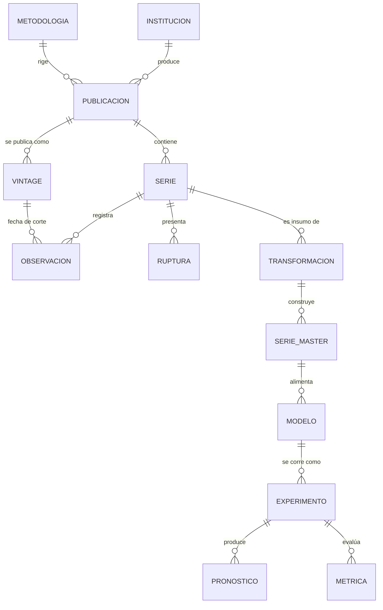

# Senda metodológica

**Proyecto:** Sistema de Información Estadística y modelos de proyección del PIB trimestral de El Salvador
**Versión:** 0.4 — documento de trabajo, enmendado
**Fecha:** julio 2026 (v0.1); 2026-08-08 (v0.2); 2026-08-17 (v0.3); 2026-08-24 (v0.4)

**Historial de versiones:**
- **0.1** (julio 2026): versión original.
- **0.2** (2026-08-08): añade a §3.4 la documentación del sufijo opcional `.RETRO` para identificadores de series (hallazgo M1, auditoría de remediación de Fase 0). Sin otros cambios de contenido.
- **0.3** (2026-08-17): añade a §7 el directorio `doc/auditorias/`, que aloja las revisiones
  independientes del repositorio y hace resolubles las citas por código de hallazgo (hallazgo
  I2, verificación de la remediación de Fase 1). Corrige el rótulo del árbol de `doc/adr/`,
  que decía `ADR-001 … ADR-008` cuando existen nueve — la procedencia de D9 como adición
  propia del proyecto ya está explicada en `doc/adr/README.md`. Sin otros cambios de contenido.
- **0.4** (2026-08-24): añade a §4 la nota de cierre de Fase 1, que fija la interpretación de
  "ingresa al proyecto" (variables admitidas en `03_series.csv`, no el inventario completo de
  `01_publicaciones`) usada para certificar el cierre. El registro del cierre —con la evidencia
  de cobertura, trazabilidad y N— está en `doc/adr/README.md`, "Cierre de Fase 1". Sin otros
  cambios de contenido.
- **Nota de publicación** (2026-08-08): el cambio de encabezado a 0.2 (este bloque de historial) se publicó en el commit `df02e43a`, posterior al tag `v0.2.0-fase0-enmendado` (que apunta a `58e6efce`). El snapshot certificado por ese tag ya contiene el contenido de §3.4 con `.RETRO`, pero conserva el encabezado rotulado como v0.1 — ver doc/adr/README.md, "Corrección de alcance del tag". No es un cambio de versión ni de contenido, solo el registro del desfase de publicación.

---

## 0. Propósito de este documento

Este documento traduce el prompt metodológico del proyecto en una secuencia ordenada de decisiones, fases y entregables. No es un cronograma administrativo: es un mapa de dependencias. Su lógica es que **ciertas decisiones deben cerrarse antes de escribir la primera línea de código**, porque su modificación posterior obliga a reconstruir todo lo que se haya edificado sobre ellas.

Se distingue en todo momento entre:

- **Hecho documentado** — información verificable en fuentes oficiales.
- **Decisión de diseño** — elección del investigador, que debe registrarse y justificarse.
- **Recomendación metodológica** — sugerencia sustentada en literatura, sujeta a discusión.

---

## 1. Reencuadre del proyecto

### 1.1 Cuál es la contribución principal

El proyecto original planteaba dos resultados complementarios de peso equivalente: el sistema de información y la comparación de modelos. Se propone modificar esa jerarquía.

La comparación entre modelos econométricos y de aprendizaje automático para pronóstico macroeconómico es un campo con literatura abundante y resultados razonablemente convergentes. Una comparación adicional para El Salvador es útil, pero no constituye por sí misma una contribución original fuerte.

En cambio, **no existe para El Salvador un sistema de información estadística macroeconómica documentado, trazable, versionado, reproducible y con registro de versiones de publicación (*vintages*)**. Ese sí es un aporte original, con valor de uso para otros investigadores, para el propio banco central y para actualizaciones futuras del proyecto.

**Recomendación:** el Sistema de Información Estadística (SIE) es el producto principal. La evaluación comparativa de modelos es la **demostración de uso** del sistema: el ejercicio que prueba que el SIE es apto para producir investigación reproducible. Esto no reduce el rigor exigido a la parte econométrica; reordena el peso argumental del documento y el criterio con que se juzga el éxito del proyecto.

### 1.2 Reformulación de los objetivos

**Objetivo general (propuesto).**
Diseñar, construir y documentar un sistema de información estadística reproducible para variables macroeconómicas de El Salvador, y demostrar su aptitud mediante la evaluación comparativa de modelos econométricos y de aprendizaje automático aplicados a la proyección del PIB trimestral.

**Objetivos específicos (propuestos).**

1. Documentar el ecosistema de producción estadística relevante: instituciones, publicaciones, metodologías y rupturas metodológicas.
2. Diseñar la arquitectura conceptual del SIE con normalización de entidades y capacidad de migración a base de datos relacional sin cambio de estructura conceptual.
3. Implementar un pipeline automatizado de adquisición, validación, transformación y construcción de series maestras, con trazabilidad completa desde el dato publicado hasta el dato modelado.
4. Establecer un protocolo de evaluación predictiva pseudo-fuera-de-muestra, con métricas por horizonte y pruebas de significancia estadística.
5. Evaluar comparativamente un conjunto balanceado de modelos en horizontes cortos y medios (h = 1 … 8 trimestres).
6. Producir proyecciones condicionales del PIB para 2026–2030 bajo escenarios explícitos de variables exógenas.
7. Publicar el sistema completo como repositorio abierto con documentación técnica y manual de actualización.

Nótese la separación de los objetivos 5 y 6. Es deliberada y se justifica a continuación.

### 1.3 Separación de los dos ejercicios predictivos

El proyecto original mezcla dos tareas que exigen tratamientos distintos.

| | **Ejercicio A: evaluación** | **Ejercicio B: proyección** |
|---|---|---|
| Pregunta | ¿Qué familia de modelos predice mejor? | ¿Cuál es la trayectoria plausible del PIB a 2030? |
| Horizonte | h = 1 … 8 trimestres | h = 1 … 20 trimestres |
| Naturaleza | Incondicional, retrospectivo | Condicional, prospectivo |
| Validación | Pseudo-fuera-de-muestra, ventana rodante | No validable; se evalúa coherencia interna |
| Métrica | RMSE / MAE por horizonte, pruebas DM/GW, MCS | Consistencia con supuestos, intervalos, escenarios |
| Rol de exógenas | Predictores evaluados | Supuestos declarados (WEO/FMI, proyecciones de socios) |

**Justificación técnica de la separación.**

Primero, un aspecto analítico que conviene anticipar: los modelos basados en árboles (Random Forest, Gradient Boosting, XGBoost, LightGBM) **no extrapolan**. Su predicción es un promedio de valores observados en hojas del árbol; fuera del rango histórico de los predictores, la predicción se satura. Sobre una serie con tendencia y a horizonte de 20 trimestres, su fracaso es una consecuencia mecánica de la arquitectura del método, no un hallazgo empírico. Someterlos a ese ejercicio y reportar que pierden equivale a "descubrir" algo conocido de antemano. La forma correcta de darles una oportunidad justa es (a) trabajar sobre transformaciones estacionarias, (b) restringir el horizonte a rangos donde el método es competitivo según la literatura, y (c) explotar su ventaja real, que es el uso de muchos predictores mensuales para horizontes cortos.

Segundo, a horizontes largos el error de pronóstico del PIB salvadoreño está dominado por la incertidumbre sobre variables externas —actividad económica de Estados Unidos, remesas, precios de importación, comercio mundial— y no por la clase funcional del modelo. Una proyección a 2030 es inevitablemente un ejercicio de escenarios condicionados. Presentarla como pronóstico incondicional sería metodológicamente insostenible.

**Implicación práctica.** El Ejercicio A produce el resultado empírico del proyecto y sustenta la selección de modelo. El Ejercicio B aplica el o los modelos seleccionados —probablemente en combinación— bajo supuestos exógenos declarados y citados, con análisis de sensibilidad. El documento debe declarar explícitamente que las cifras de 2026–2030 son condicionales.

---

## 2. Decisiones fundacionales

Estas ocho decisiones deben quedar cerradas y documentadas en la Fase 0. Cada una debe registrarse como un ADR (*Architecture Decision Record*): un archivo breve con contexto, alternativas consideradas, decisión adoptada y consecuencias.

### D1. Definición operativa exacta de la variable objetivo

El prompt original nunca especifica qué es "el PIB". Es la decisión de mayor consecuencia aguas abajo. Debe fijarse:

- **Concepto:** PIB a precios constantes (volumen).
- **Base y sistema:** año de referencia y sistema de cuentas nacionales aplicable.
- **Ajuste estacional:** serie original, desestacionalizada, o ambas. Si desestacionalizada: ¿la oficial del BCR, o una propia con X-13ARIMA-SEATS o JDemetra+? Si es propia, debe documentarse el problema de ajuste estacional en presencia del *shock* de 2020.
- **Unidad de modelación:** nivel, logaritmo, tasa trimestral, tasa interanual. La elección condiciona la estacionariedad, la interpretación de las métricas de error y la comparabilidad entre modelos.
- **Enfoque de agregación:** modelación del agregado (*top-down*) o suma de proyecciones por actividad económica (*bottom-up*). La segunda opción multiplica el trabajo pero suele mejorar la precisión y permite narrativa sectorial; puede quedar como extensión.
- **Vintage de referencia:** con qué versión de publicación se evalúa (ver D7).

*Recomendación:* modelar el logaritmo del PIB real desestacionalizado, reportar resultados en tasa interanual (que es la métrica de interés para política), y documentar la transformación como una cadena explícita en el catálogo de transformaciones. Fijar el enfoque *top-down* como línea base y dejar *bottom-up* como extensión.

### D2. Horizonte y diseño de los dos ejercicios

Adoptar la separación de la sección 1.3. Definir formalmente: horizontes evaluados en A, período de evaluación, número de reestimaciones, y fuente de supuestos exógenos en B.

### D3. Tratamiento del empalme de cuentas nacionales

**Advertencia central.** El prompt asume series trimestrales continuas desde ~1990. Debe verificarse antes de cualquier otra cosa. El BCR migró al SCN 2008 con un nuevo año de referencia, y las series bajo la metodología vigente no necesariamente cubren todo el período histórico bajo la misma base. Es probable que la serie utilizable sea **ella misma un empalme entre dos sistemas de cuentas nacionales distintos**.

Esto no es un detalle técnico menor: es una decisión metodológica sustantiva que afecta a la variable dependiente. Debe documentarse:

- cobertura temporal exacta de cada versión de la serie;
- si existe retropolación oficial del BCR y hasta qué año;
- si el empalme es propio, el método utilizado (enlace por tasas de variación, Denton, Denton-Cholette, Chow-Lin) y su justificación;
- el número efectivo de observaciones "homogéneas" versus "empalmadas", y la sensibilidad de los resultados a excluir el tramo empalmado.

*Entregable:* una nota metodológica específica sobre el empalme, y una variante de robustez que estime todos los modelos únicamente sobre el tramo homogéneo.

### D4. Tratamiento de quiebres estructurales y del *shock* de 2020

Con una muestra de ~140 observaciones, el trimestre de mayor contracción de 2020 domina la estimación de la matriz de covarianzas de cualquier VAR y la varianza residual de cualquier modelo con volatilidad constante. Una variable dicotómica simple no resuelve el problema: distorsiona la estimación de la dinámica.

Debe adoptarse y documentarse una estrategia explícita. Opciones en la literatura:

- exclusión de los trimestres afectados de la estimación de la verosimilitud;
- variables dicotómicas con decaimiento estimado (Lenza–Primiceri);
- volatilidad estocástica o errores con colas gruesas;
- tratamiento como *outlier* aditivo/transitorio en la fase de ajuste estacional (Ng y coautores);
- estimación en dos submuestras con contraste de estabilidad.

Otros quiebres candidatos que deben documentarse aunque no se modelen: dolarización (2001), terremotos (2001), entrada en vigor del CAFTA-DR, crisis financiera global (2008–2009), adopción de bitcoin como moneda de curso legal (2021), y cambios de base y metodología en índices de precios y empleo.

*Recomendación:* estrategia principal + al menos una alternativa como prueba de robustez. Reportar ambas.

### D5. Soporte tecnológico de los catálogos

**Observación:** el prompt establece que "nunca deberán proponerse procesos manuales si existe una alternativa automatizable" y a la vez que el sistema se construirá "mediante hojas de cálculo estructuradas". Ambas cosas son incompatibles. Las hojas de cálculo:

- invitan a la edición manual no registrada;
- no producen *diffs* legibles en control de versiones;
- ocultan lógica dentro de fórmulas de celda, fuera del alcance de la revisión por pares;
- alteran silenciosamente tipos de dato (fechas, ceros a la izquierda, notación decimal);
- rompen la trazabilidad que el proyecto declara como principio.

**Alternativa recomendada:** catálogos en **texto plano versionado en Git**.

- Catálogos con muchos registros de estructura homogénea (series, observaciones, transformaciones): **CSV** con esquema declarado.
- Catálogos con pocos registros y campos narrativos largos (publicaciones, metodologías, modelos): **YAML**, un archivo por registro, o CSV con campos de texto.
- Esquema validado formalmente: *Frictionless Data Table Schema* (`datapackage.json`) y validación automática en el pipeline con `pandera` (Python) o `pointblank` / `validate` (R).
- Datos consolidados en **DuckDB** o **SQLite** como artefacto derivado, generado por código, nunca editado a mano.

Esto conserva la facilidad de edición y lectura de una hoja de cálculo, se visualiza correctamente en GitHub, permite revisión línea por línea, y hace que la migración a base de datos relacional sea un *script*, no un rediseño. Si se requiere una interfaz de edición cómoda, puede exportarse una vista a hoja de cálculo, pero la **fuente de verdad** es el texto plano.

### D6. Vocabulario de metadatos

No inventar un esquema propio si existe uno interoperable. Se recomienda alinear los nombres y la semántica de los campos con **SDMX** —el estándar que ya utilizan el BCR, la SECMCA, el FMI, el Banco Mundial y la CEPAL— al menos en el nivel de conceptos: `FREQ`, `REF_AREA`, `UNIT_MEASURE`, `UNIT_MULT`, `ADJUSTMENT`, `REF_PERIOD`, `OBS_STATUS`, `TIME_PERIOD`, `DECIMALS`, `TITLE`, `SOURCE_AGENCY`.

Beneficios: interoperabilidad, credibilidad institucional del diseño, y facilidad para incorporar series de organismos internacionales sin re-mapear conceptos.

### D7. Política de versiones de publicación (*vintages*)

**Esta es, a mi juicio, la decisión que más valor agrega al proyecto.**

El PIB trimestral se revisa. Si los modelos se evalúan contra la serie revisada más reciente, se les entrega información que no existía en el momento en que el pronóstico habría sido emitido. El resultado deja de ser replicable en operación real y sobreestima la precisión alcanzable.

Un sistema de información con **diseño bitemporal** —cada observación indexada por período de referencia *y* por fecha de publicación— permite:

1. evaluación predictiva honesta en tiempo real;
2. cuantificación de la magnitud y el sesgo de las revisiones del PIB salvadoreño, que es en sí mismo un resultado publicable e inexistente en la literatura local;
3. reproducción exacta de cualquier resultado del proyecto en cualquier fecha futura.

**Decisión requerida.** El registro histórico completo de *vintages* previos a la fecha de inicio del proyecto puede ser imposible de reconstruir si el BCR no conserva publicaciones archivadas. Alternativas:

- **(a) Vintages prospectivos:** el sistema captura y archiva cada nueva publicación desde el inicio del proyecto. Factible con certeza; el registro crece con el tiempo.
- **(b) Reconstrucción retrospectiva:** rescate de publicaciones históricas (boletines, revistas trimestrales, informes, copias en Wayback Machine, publicaciones de la SECMCA y del FMI). Alto costo, resultado incierto y probablemente incompleto.
- **(c) Enfoque híbrido:** (a) como compromiso firme, (b) como esfuerzo de mejor empeño, documentando explícitamente la cobertura lograda.

*Recomendación:* (c). Y con independencia de cuánto se logre reconstruir, **el diseño de la base debe ser bitemporal desde el primer día**. Añadir la dimensión de vintage después obliga a rehacer el modelo de datos completo.

### D8. Licencias y condiciones de redistribución

Debe resolverse antes de publicar el repositorio:

- condiciones de uso y redistribución de los datos del BCR, DIGESTYC/ONEC, ISSS y organismos internacionales;
- licencia del código (MIT o GPL-3.0);
- licencia de la documentación (CC-BY-4.0);
- política respecto a datos que no pueden redistribuirse: en tal caso el repositorio publica el *script* de descarga y el *checksum*, no el archivo.

---

## 3. Arquitectura del Sistema de Información Estadística

### 3.1 Arquitectura por capas

El flujo de datos se organiza en capas unidireccionales. **Ninguna capa se edita manualmente; cada una es producida por código a partir de la anterior.**

```
  ┌─────────────────────────────────────────────────────────┐
  │ L0  RAW — inmutable                                     │
  │ Archivos tal como fueron publicados. Nunca se modifican.│
  │ Nombre: {fuente}_{publicacion}_{fecha_descarga}.{ext}   │
  │ Acompañado de manifiesto: URL, timestamp, SHA-256,      │
  │ tamaño, código HTTP, vintage asociado.                  │
  └───────────────────────────┬─────────────────────────────┘
                              ▼
  ┌─────────────────────────────────────────────────────────┐
  │ L1  STAGING — normalización estructural                 │
  │ Formato largo: serie_id | periodo | vintage | valor |   │
  │ obs_status. Sin decisiones económicas, solo estructura.  │
  └───────────────────────────┬─────────────────────────────┘
                              ▼
  ┌─────────────────────────────────────────────────────────┐
  │ L2  VALIDATED — control de calidad                      │
  │ Validación de esquema, tipos, rangos, continuidad,      │
  │ duplicados, coherencia de agregados y de identidades    │
  │ contables. Bitácora de incidencias.                      │
  └───────────────────────────┬─────────────────────────────┘
                              ▼
  ┌─────────────────────────────────────────────────────────┐
  │ L3  MASTER — series analíticas                          │
  │ Empalmes, deflactación, ajuste estacional, cambios de   │
  │ frecuencia, transformaciones. Cada serie master declara │
  │ su linaje completo hacia L0.                             │
  └───────────────────────────┬─────────────────────────────┘
                              ▼
  ┌─────────────────────────────────────────────────────────┐
  │ L4  EXPERIMENTS — resultados de modelación              │
  │ Especificaciones, corridas, pronósticos, métricas,      │
  │ pruebas. Reproducible con semilla y vintage fijados.     │
  └─────────────────────────────────────────────────────────┘
```

**Principio de inmutabilidad de L0.** Es la piedra angular de la reproducibilidad. El BCR no ofrece una API estable; los enlaces cambian, los formatos cambian, las series se reorganizan. Sin una copia local archivada con *checksum*, la reproducibilidad es aspiracional. Todo *script* de descarga debe (i) descargar, (ii) calcular SHA-256, (iii) comparar con el manifiesto, (iv) registrar si el archivo cambió respecto de la descarga anterior, (v) nunca sobrescribir.

### 3.2 Modelo conceptual de entidades



Dos adiciones respecto del diseño original merecen énfasis.

**Vintage como entidad propia.** No es un atributo de la observación: es un hecho de publicación con fecha, documento fuente y alcance. Modelarlo como entidad evita redundancia y permite consultas del tipo "reconstruir la base tal como se conocía en una fecha dada".

**Separación entre modelo y experimento.** Un *modelo* es una especificación (familia, variables, órdenes, hiperparámetros, transformaciones). Un *experimento* es una corrida concreta: especificación + vintage + ventana de estimación + esquema de validación + semilla + versión del código. Confundirlos hace imposible reproducir resultados o comparar de forma controlada. Son entidades distintas.

### 3.3 Catálogos

Se propone extender los seis catálogos originales a nueve.

| Código | Catálogo | Contenido |
|---|---|---|
| `00` | `instituciones` | Productores de información. Nuevo. Evita repetir datos institucionales en cada publicación. |
| `01` | `publicaciones` | Productos estadísticos: nombre, institución, periodicidad, formato, URL, cobertura, condiciones de uso. |
| `02` | `metodologias` | Marcos metodológicos: SCN 2008, SCN 1993, manuales de balanza de pagos, metodologías de índices. Vigencia y documento de referencia. |
| `03` | `series` | Series tal como se publican. Identificador, publicación de origen, concepto SDMX, frecuencia, unidad, base, ajuste, cobertura, rupturas. |
| `04` | `transformaciones` | Operaciones aplicadas: tipo, insumos, producto, parámetros, *script*, justificación. Encadenables. |
| `05` | `series_master` | Series analíticas finales, con linaje declarado y rol en la modelación. |
| `06` | `modelos` | Especificaciones de modelos. |
| `07` | `experimentos` | Corridas, resultados y métricas. **Nuevo.** |
| `08` | `vintages` | Registro de versiones de publicación. **Nuevo.** |
| `09` | `rupturas` | Quiebres metodológicos, cambios de base, eventos de discontinuidad. **Nuevo** (puede fusionarse en `03` si resulta ligero). |

**Campos mínimos indicativos.**

`03_series`: `serie_id`, `publicacion_id`, `nombre_oficial`, `concepto`, `freq`, `unit_measure`, `unit_mult`, `adjustment`, `base_year`, `metodologia_id`, `inicio`, `fin`, `fuente_celda`, `notas`.

`04_transformaciones`: `transf_id`, `tipo`, `series_insumo`, `serie_producto`, `parametros`, `script_path`, `funcion`, `justificacion`, `metodologia_ref`, `reversible`.

`07_experimentos`: `exp_id`, `modelo_id`, `vintage_id`, `muestra_inicio`, `muestra_fin`, `esquema_validacion`, `horizontes`, `semilla`, `commit_hash`, `fecha_corrida`, `entorno`, `ruta_resultados`.

`08_vintages`: `vintage_id`, `publicacion_id`, `fecha_publicacion`, `periodo_referencia_max`, `documento_fuente`, `archivo_raw`, `sha256`, `alcance_revision`, `notas`.

### 3.4 Convenciones e identificadores

- Identificadores **legibles y estables**, no números correlativos: `BCR.PIB.VOL.SA.Q`, `BCR.IVAE.IDX.NSA.M`, `USA.GDP.VOL.SA.Q`. Estructura `{fuente}.{concepto}.{unidad}.{ajuste}.{frecuencia}`.
- Sufijo adicional opcional, tras `{frecuencia}`, para distinguir un tramo de captura distinta de la misma serie conceptual — ej. `BCR.PIB.VOL.NSA.Q.RETRO` para el tramo retropolado 1990-2005, frente a `BCR.PIB.VOL.NSA.Q` de la compilación nativa 2005-2026 (M1, 2026-08-08). No rompe el patrón base de 5 componentes; se usa solo cuando el vínculo entre tramos ya está documentado en `03_series` (columna `notas`).
- Períodos en formato ISO 8601: `2024-Q3`, `2024-07`.
- Codificación UTF-8, separador decimal punto, sin separador de miles, valores ausentes como celda vacía (nunca `0`, `-`, `n.d.`).
- Nombres de campo en `snake_case`, sin acentos ni espacios.
- Un `README.md` por directorio de catálogo, con diccionario de variables.

### 3.5 Validación automatizada

El pipeline debe fallar —no advertir— ante:

- incumplimiento de esquema (tipos, campos obligatorios, dominios);
- violación de integridad referencial entre catálogos (`publicacion_id` inexistente, etc.);
- duplicados en la clave `(serie_id, periodo, vintage_id)`;
- huecos no declarados en series;
- inconsistencia entre agregados y componentes por encima de una tolerancia declarada;
- *checksum* de archivo raw distinto del registrado sin un nuevo vintage asociado.

Ejecución en integración continua (GitHub Actions) en cada *commit*. La bitácora de validación es un entregable del proyecto, no un artefacto interno.

---

## 4. Senda por fases

### Fase 0 — Decisiones fundacionales y andamiaje
*Precede a todo lo demás.*

Actividades: resolver D1–D8; registrar los ADR; crear el repositorio con su estructura; definir el entorno reproducible (`renv` para R, `uv`/`pixi` para Python, contenedor opcional); configurar integración continua; redactar `CONTRIBUTING.md` y convenciones.

Entregables: repositorio inicializado; ocho ADR; documento de convenciones; entorno reproducible verificado en máquina limpia.

**Criterio de cierre:** un tercero puede clonar el repositorio y reproducir el entorno sin intervención del autor.

### Fase 1 — Inventario del ecosistema estadístico

Actividades: relevamiento exhaustivo de instituciones y publicaciones (BCR, ONEC/DIGESTYC, ISSS, Ministerio de Hacienda, SECMCA, FMI, Banco Mundial, CEPAL, BID, Reserva Federal/BEA para EE.UU.); documentación de metodologías vigentes e históricas; identificación de rupturas; verificación de disponibilidad efectiva, frecuencia, cobertura y condiciones de uso de cada serie candidata.

Entregables: catálogos `00`, `01`, `02`, `09` poblados; nota metodológica sobre rupturas; **nota específica sobre el empalme de cuentas nacionales (D3), con el recuento efectivo de observaciones utilizables.**

**Criterio de cierre:** ninguna variable ingresa al proyecto sin registro verificado de disponibilidad, cobertura y frecuencia. El número real de observaciones de la variable objetivo está establecido y documentado.

> Esta fase es el filtro contra el riesgo más común en proyectos de este tipo: diseñar un modelo alrededor de variables que no existen con la cobertura supuesta.

**Nota de cierre — alcance de "ingresa al proyecto" (2026-08-24).** El criterio se interpreta y
certifica sobre las variables *admitidas* —las series registradas en `catalogos/03_series.csv`—,
no sobre el inventario completo de `01_publicaciones`. Es la lectura del texto ("ninguna variable
*ingresa*", no "ninguna publicación se inventaría") y del modelo de entidades (§3.2): una variable
ingresa al proyecto como *serie* (`03_series` → transformaciones → `series_master` → modelos), no
como publicación; una publicación inventariada de la que aún no se extrajo ninguna serie es parte
del mapa del ecosistema, pero ninguna variable suya ha ingresado. La verificación de
disponibilidad/cobertura/frecuencia de esas publicaciones es una compuerta *just-in-time* que se
aplica cuando una serie suya entra a `03_series` (Fase 3). Las **condiciones de uso** quedan fuera
de este criterio por diseño de la propia senda —la lista de actividades de esta fase las incluye,
el criterio de cierre no las nombra— y se gobiernan por ADR-008 (D8) con sus cortes fechados. El
registro del cierre, con su evidencia, está en `doc/adr/README.md`, "Cierre de Fase 1".

### Fase 2 — Adquisición automatizada y capa raw

Actividades: desarrollo de *scripts* de descarga por publicación; implementación del manifiesto con *checksums*; captura del vintage inicial; documentación de la fragilidad de cada fuente y del procedimiento de recuperación ante cambios; inicio de la captura prospectiva de vintages.

Entregables: `src/adquisicion/` funcional; capa L0 poblada; catálogo `08` inicializado; bitácora de fuentes frágiles.

**Criterio de cierre:** ejecutar `make raw` reconstruye la capa L0 desde cero o verifica su integridad, sin pasos manuales.

### Fase 3 — Normalización, validación y series maestras

Actividades: L0 → L1 (formato largo); implementación de la batería de validaciones (L2); implementación de transformaciones documentadas (L3): empalmes, deflactación, ajuste estacional, cambios de frecuencia, logaritmos y diferencias; análisis exploratorio y de estacionariedad; construcción de la matriz de predictores.

Entregables: catálogos `03`, `04`, `05` poblados; base maestra bitemporal; reporte de calidad de datos; reporte exploratorio; **matriz de predictores mensuales y trimestrales con su cobertura documentada**.

**Criterio de cierre:** cada valor de la base maestra puede rastrearse hasta la celda del archivo original que lo originó, y la cadena de transformaciones que lo produjo es ejecutable como código.

### Fase 4 — Protocolo de evaluación

Actividades: definición formal del diseño de validación (sección 5); implementación del motor de *backtesting*; implementación de los modelos de referencia; verificación de que el motor reproduce resultados conocidos en datos sintéticos.

Entregables: `src/evaluacion/` funcional; documento de protocolo; resultados de los *benchmarks*.

**Criterio de cierre:** el motor de evaluación funciona y está probado **antes** de estimar cualquier modelo sofisticado. Definir las reglas después de ver los resultados invalida el ejercicio.

> Este orden no es negociable. Es la diferencia entre una evaluación predictiva y una búsqueda de especificación favorable.

### Fase 5 — Estimación y comparación (Ejercicio A)

Actividades: implementación del conjunto de modelos (sección 6); ajuste de hiperparámetros mediante validación anidada respetando el orden temporal; ejecución del *backtesting*; cálculo de métricas por horizonte; pruebas de significancia; construcción de combinaciones de pronósticos; pruebas de robustez.

Entregables: catálogos `06` y `07` poblados; tablas de resultados por horizonte; pruebas DM/GW y conjunto de modelos de confianza; análisis de robustez.

**Criterio de cierre:** todo resultado reportado es reproducible con una sola orden y una semilla fijada.

### Fase 6 — Proyección condicional (Ejercicio B)

Actividades: definición y documentación de escenarios exógenos con fuentes citadas; proyección 2026–2030; construcción de intervalos; análisis de sensibilidad a los supuestos; validación de coherencia interna.

Entregables: proyecciones por escenario; documento de supuestos; análisis de sensibilidad.

**Criterio de cierre:** cada supuesto exógeno tiene fuente citada y el resultado se declara explícitamente como condicional.

### Fase 7 — Documentación, publicación y sostenibilidad

Actividades: documentación técnica del SIE; manual de actualización periódica; *vignettes* reproducibles; sitio de documentación (Quarto); asignación de DOI (Zenodo); definición del procedimiento de actualización trimestral.

Entregables: repositorio público completo; manual de usuario; sitio de documentación; DOI.

**Criterio de cierre:** un investigador externo puede actualizar el sistema con la publicación del trimestre siguiente siguiendo únicamente el manual.

---

## 5. Protocolo de evaluación predictiva

Este es el vacío más significativo del diseño original y donde se juega la credibilidad del capítulo empírico.

### 5.1 Esquema de validación

- **Diseño:** validación pseudo-fuera-de-muestra con reestimación en cada paso.
- **Ventana:** expansiva como opción principal —maximiza la información disponible, lo que importa con muestras cortas— y rodante como robustez, para detectar inestabilidad de parámetros.
- **Origen de evaluación:** el punto de inicio debe garantizar un mínimo razonable de observaciones para la estimación inicial y un número suficiente de orígenes de pronóstico para que las pruebas de significancia tengan potencia. Con ~140 observaciones esto implica un compromiso explícito que debe justificarse numéricamente, no elegirse por conveniencia.
- **Horizontes:** h = 1, 2, 4, 8. Reportados por separado, nunca agregados en un único indicador.

### 5.2 Ajuste de hiperparámetros

Los modelos de aprendizaje automático requieren selección de hiperparámetros. Debe hacerse mediante **validación anidada que respete el orden temporal** (`TimeSeriesSplit` o equivalente), dentro de cada ventana de estimación. Usar todo el histórico para elegir hiperparámetros y luego "evaluar fuera de muestra" es filtración de información y anula la comparación. Debe documentarse la grilla de búsqueda y el criterio de selección.

Simetría exigible: si se ajustan hiperparámetros del ML por validación, los órdenes de los modelos ARIMA/VAR también deben seleccionarse dentro de cada ventana por criterio de información, no fijarse de antemano con la muestra completa.

### 5.3 Métricas

- RMSE y MAE por horizonte, en la unidad de interés.
- Métricas relativas al *benchmark* ingenuo (RMSE relativo).
- Métricas de calibración de la incertidumbre: cobertura empírica de los intervalos, CRPS o *log score* si se producen densidades predictivas.
- Sesgo medio, para detectar errores sistemáticos.

### 5.4 Pruebas de significancia

- **Diebold–Mariano** para comparaciones por pares; con la corrección de Harvey–Leybourne–Newbold, indispensable en muestras pequeñas.
- **Giacomini–White** cuando hay reestimación por ventanas.
- **Model Confidence Set** (Hansen, Lunde y Nason) como prueba principal: cuando se comparan más de diez modelos, las comparaciones por pares acumulan error de tipo I y el "ganador" puede ser ruido. El MCS entrega el conjunto de modelos estadísticamente indistinguibles del mejor, que es la respuesta honesta con esta muestra.

**Expectativa realista:** con ~140 observaciones y un número limitado de orígenes de pronóstico, es probable que el MCS contenga varios modelos y que no se pueda declarar un ganador único. **Ese es un resultado legítimo y debe reportarse como tal.** Forzar una conclusión de superioridad que los datos no sustentan sería el peor desenlace posible del proyecto.

### 5.5 Evaluación en tiempo real

Si el registro de vintages lo permite, replicar la evaluación usando el vintage disponible en cada origen de pronóstico. La comparación entre resultados con datos revisados y con datos en tiempo real es un resultado de interés propio y una demostración directa del valor del SIE.

---

## 6. Conjunto de modelos rebalanceado

El conjunto original tiene redundancia en aprendizaje automático y omisiones relevantes en métodos que la literatura señala como competitivos en muestras cortas.

### 6.1 Referencias obligatorias

Sin *benchmark* ingenuo no hay resultado interpretable.

- Paseo aleatorio (con y sin deriva).
- AR(1) y AR(p) con orden por criterio de información.
- Promedio histórico de la tasa de crecimiento.
- Suavizamiento exponencial (ETS).

### 6.2 Series de tiempo univariadas

- ARIMA / SARIMA con selección automática de órdenes.
- ARIMAX con predictores externos.
- Modelos de espacio de estados / componentes no observados.

### 6.3 Multivariados

- VAR en niveles y en diferencias, con órdenes reducidos por la restricción muestral.
- VECM previo análisis de cointegración.
- **BVAR con *priors* jerárquicos** (Giannone, Lenza y Primiceri) en lugar de "modelos bayesianos" genérico. Es la forma técnicamente correcta de incorporar más variables que grados de libertad, y con esta muestra probablemente el competidor más fuerte del conjunto.
- Modelos factoriales dinámicos, si el número de predictores lo justifica.

### 6.4 Frecuencia mixta — *omisión importante del diseño original*

El proyecto dispone de predictores mensuales: índice de volumen de actividad económica, remesas, comercio exterior, precios, empleo cotizante, energía, turismo, recaudación. Ignorar la frecuencia mensual desperdicia la principal ventaja informativa del sistema y es precisamente donde el enfoque de "sistema de información" rinde su mayor beneficio.

- **MIDAS** y U-MIDAS.
- **Ecuaciones puente** (*bridge equations*), estándar operativo en bancos centrales.
- Modelos factoriales dinámicos de frecuencia mixta para *nowcasting*.

Adicionalmente, esto habilita un tercer ejercicio de bajo costo marginal y alto valor: **nowcasting del trimestre en curso**, donde el aprendizaje automático y la frecuencia mixta tienen su ventaja documentada. Se recomienda incorporarlo.

### 6.5 Métodos lineales regularizados — *también ausentes*

Son el contrincante justo del aprendizaje automático en muestras cortas, y con frecuencia lo superan.

- Ridge, LASSO, elastic net.
- Regresión por componentes principales; *targeted predictors* (Bai y Ng).
- Mínimos cuadrados parciales (PLS).

### 6.6 Aprendizaje automático

Reducir la redundancia: Random Forest, Gradient Boosting, XGBoost y LightGBM son cuatro implementaciones de dos ideas. Se recomienda **un representante de *bagging* (Random Forest) y uno de *boosting* (XGBoost o LightGBM, no ambos)**, con la mejora en eficiencia computacional reinvertida en frecuencia mixta y combinaciones.

Consideraciones obligatorias: aplicar sobre transformaciones estacionarias; documentar la incapacidad de extrapolación; y —si se pretende interpretación— usar importancia por permutación o SHAP, no la importancia por impureza, que está sesgada.

### 6.7 Combinación de pronósticos — *la omisión más notable*

En la literatura de pronóstico macroeconómico, las combinaciones simples superan de forma sistemática a los modelos individuales, y el "enigma del promedio simple" está bien documentado. Debe formar parte del conjunto evaluado.

- Promedio simple, mediana, *trimmed mean*.
- Ponderación inversa al error histórico.
- Combinación por desempeño con descuento temporal.
- Regresión de combinación restringida (si el número de orígenes lo permite).

Es plausible que el mejor resultado del proyecto sea una combinación. Ese es un hallazgo valioso y coherente con la literatura.

---

## 7. Estructura del repositorio

```
pib-el-salvador/
├── README.md
├── LICENSE                     # código
├── LICENSE-docs                # documentación (CC-BY)
├── CITATION.cff
├── Makefile                    # orquestación: make raw|clean|master|eval|report
├── renv.lock / pyproject.toml
│
├── doc/
│   ├── adr/                    # ADR-001 … ADR-009
│   ├── auditorias/             # revisiones independientes; sin autoridad decisoria
│   ├── metodologia/
│   │   ├── empalme_cuentas_nacionales.md
│   │   ├── tratamiento_covid.md
│   │   ├── protocolo_evaluacion.md
│   │   └── supuestos_escenarios.md
│   ├── manual_actualizacion.md
│   └── diccionario_datos.md
│
├── catalogos/
│   ├── datapackage.json        # esquema formal
│   ├── 00_instituciones.csv
│   ├── 01_publicaciones/       # YAML por registro
│   ├── 02_metodologias/
│   ├── 03_series.csv
│   ├── 04_transformaciones.csv
│   ├── 05_series_master.csv
│   ├── 06_modelos/
│   ├── 07_experimentos.csv
│   ├── 08_vintages.csv
│   └── 09_rupturas.csv
│
├── data/
│   ├── L0_raw/                 # inmutable + manifiesto.csv
│   ├── L1_staging/             # generado
│   ├── L2_validated/           # generado
│   ├── L3_master/              # generado
│   └── L4_experiments/         # generado
│
├── src/
│   ├── adquisicion/
│   ├── validacion/
│   ├── transformacion/
│   ├── modelos/
│   ├── evaluacion/
│   └── reportes/
│
├── tests/
├── notebooks/                  # exploración; no parte del pipeline
└── .github/workflows/          # CI: validación de esquemas y pruebas
```

Regla: los directorios `data/L1`–`L4` **no se versionan en Git** (salvo artefactos pequeños de resultados). Se versiona el código que los genera y el manifiesto de L0. Para archivos raw grandes, considerar Git LFS o almacenamiento externo con *checksum* registrado.

---

## 8. Gestión de riesgos

| Riesgo | Probabilidad | Impacto | Mitigación |
|---|---|---|---|
| Cobertura de la serie de PIB menor a lo supuesto tras el empalme | Alta | Alto | Verificación en Fase 1 antes de fijar el diseño; escenario de contingencia con muestra reducida |
| Cambio de estructura del portal o de formatos del BCR | Alta | Medio | Capa L0 inmutable; *scripts* modulares por publicación; monitoreo de *checksums* |
| Imposibilidad de reconstruir vintages históricos | Alta | Medio | Enfoque híbrido D7; captura prospectiva garantizada; documentar cobertura lograda |
| MCS no discrimina entre modelos | Media-alta | Bajo | Aceptado y reportado como resultado; el énfasis del proyecto está en el SIE |
| Predictores mensuales con cobertura insuficiente | Media | Medio | Verificación en Fase 1; conjunto de predictores con variantes de cobertura |
| Sobreajuste por decisiones tomadas viendo resultados | Media | Alto | Protocolo cerrado y probado en Fase 4, antes de Fase 5; registro de todas las especificaciones evaluadas |
| Alcance excesivo para un primer proyecto académico | Alta | Alto | Núcleo mínimo viable (sección 9); extensiones explícitamente diferidas |
| Restricciones de redistribución de datos | Baja-media | Medio | Resolver en D8; publicar *scripts* en lugar de datos cuando aplique |

---

## 9. Núcleo mínimo viable y extensiones

Siendo un primer proyecto académico, conviene fijar desde el inicio qué constituye un resultado completo y qué es extensión opcional. Esto protege contra la expansión indefinida del alcance.

**Núcleo mínimo viable (compromiso firme):**

- SIE con capas L0–L3, nueve catálogos, diseño bitemporal y validación automatizada.
- Variable objetivo única, enfoque *top-down*.
- Protocolo de evaluación implementado y probado.
- Referencias + ARIMA/ARIMAX + VAR/BVAR + regularización lineal + un método de árboles + combinaciones.
- Horizontes h = 1, 2, 4, 8 con DM/GW y MCS.
- Proyección condicional 2026–2030 con dos o tres escenarios.
- Repositorio público documentado con manual de actualización.

**Extensiones, en orden de prioridad:**

1. Frecuencia mixta (MIDAS / ecuaciones puente) y *nowcasting*.
2. Reconstrucción retrospectiva de vintages y estudio de revisiones del PIB.
3. Enfoque *bottom-up* por actividad económica.
4. Modelos factoriales dinámicos.
5. Migración a base de datos relacional con interfaz de consulta.
6. Cuantificación de la incertidumbre por *bootstrap* en modelos de ML.

*Recomendación:* la extensión 1 tiene la mejor relación entre valor añadido y costo, y sería la primera a incorporar si el tiempo lo permite.

---

## 10. Criterios de calidad transversales

Todo entregable debe satisfacer:

1. **Reproducibilidad.** Ejecutable con una orden, en entorno limpio, por un tercero, obteniendo resultados idénticos.
2. **Trazabilidad.** Cada valor rastreable hasta su celda de origen en un archivo publicado con *checksum* registrado.
3. **Justificación.** Cada decisión metodológica con fundamento estadístico o econométrico y referencia bibliográfica.
4. **Diferenciación epistémica.** Separación explícita entre dato oficial, transformación propia, inferencia y recomendación.
5. **Automatización.** Ningún paso manual donde exista alternativa programable.
6. **Ausencia de redundancia.** Cada hecho registrado en un solo lugar del sistema.
7. **Alineamiento institucional.** Respeto y cita de las metodologías oficiales del BCR y la SECMCA.

---

## 11. Referencias metodológicas de base

**Evaluación predictiva.** Diebold y Mariano (1995); Harvey, Leybourne y Newbold (1997); West (1996); Clark y West (2007); Giacomini y White (2006); Hansen, Lunde y Nason (2011); Tashman (2000).

**Combinación de pronósticos.** Bates y Granger (1969); Timmermann (2006); Elliott y Timmermann (2016); Claeskens et al. (2016) sobre el enigma del promedio simple.

**VAR bayesianos y muestras cortas.** Litterman (1986); Bańbura, Giannone y Reichlin (2010); Giannone, Lenza y Primiceri (2015); Chan (2020).

**Frecuencia mixta y nowcasting.** Ghysels, Santa-Clara y Valkanov (2004); Giannone, Reichlin y Small (2008); Bańbura, Giannone, Modugno y Reichlin (2013); Foroni y Marcellino (2014).

**Factores y predictores de alta dimensión.** Stock y Watson (2002); Bai y Ng (2008); De Mol, Giannone y Reichlin (2008).

**Aprendizaje automático en macroeconomía.** Medeiros, Vasconcelos, Veiga y Zilberman (2021); Coulombe, Leroux, Stevanovic y Surprenant (2022); Goulet Coulombe et al. sobre por qué el ML funciona —o no— en macro; Masini, Medeiros y Mendes (2023).

**Datos en tiempo real y vintages.** Croushore y Stark (2001); Croushore (2011); Orphanides y van Norden (2002).

**Tratamiento del *shock* de 2020.** Lenza y Primiceri (2022); Schorfheide y Song (2021); Ng (2021); Carriero et al. (2022).

**Empalme y desagregación temporal.** Denton (1971); Chow y Lin (1971); Dagum y Cholette (2006).

**Reproducibilidad y ciencia abierta.** Wilson et al. (2017), *Good Enough Practices in Scientific Computing*; Gentzkow y Shapiro (2014), *Code and Data for the Social Sciences*; Peng (2011).

**Estándares de metadatos.** SDMX 3.0, *Content-Oriented Guidelines*; Frictionless Data, *Table Schema* y *Data Package*.

**Marcos oficiales.** Naciones Unidas et al. (2009), *Sistema de Cuentas Nacionales 2008*; FMI, *Quarterly National Accounts Manual* (2017); metodologías publicadas del BCR y de la SECMCA.

---

## 12. Próximos pasos inmediatos

1. **Verificar D3.** Establecer la cobertura temporal real de la serie de PIB trimestral bajo la metodología vigente y determinar el número efectivo de observaciones. Es la restricción que condiciona todo el diseño y ninguna otra decisión debe cerrarse antes.
2. Redactar los ADR de D1, D2, D5 y D7, que son las decisiones estructurales del sistema.
3. Inicializar el repositorio con la estructura de la sección 7 y el entorno reproducible.
4. Iniciar el catálogo `01_publicaciones` con las publicaciones del BCR, verificando disponibilidad efectiva de cada una.
5. Comenzar de inmediato la captura prospectiva de vintages: cada publicación no archivada hoy es información que se pierde de forma irrecuperable.
